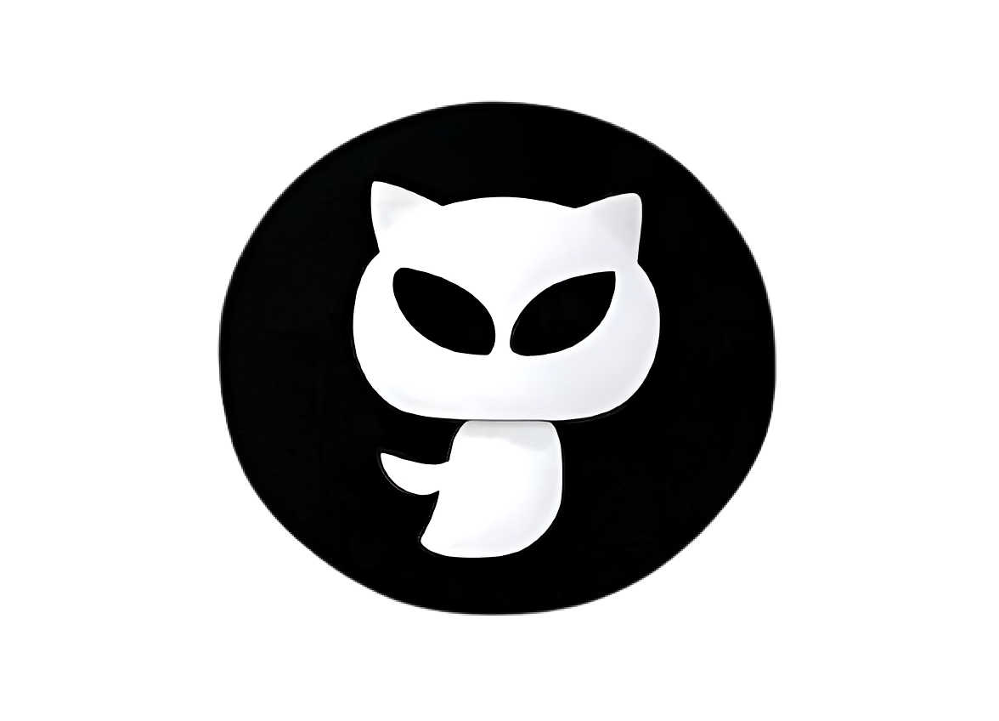

# PR MenuBar

A beautiful macOS menu bar app for monitoring GitHub pull requests in real-time.



## Features

- 🎯 **Real-time PR monitoring** - Get instant notifications about new pull requests
- 📊 **Visual metrics** - See open PRs and review requests at a glance
- 🔍 **Smart filtering** - Filter by open PRs or those awaiting review
- 🎨 **Beautiful UI** - Modern, native macOS design with dark theme
- ⚡ **Lightweight** - Minimal resource usage, runs in the background
- 🔔 **Notifications** - Get notified when PR counts change
- ⚙️ **Easy setup** - Simple GitHub token configuration

## Installation

### Download Latest Release

1. Go to the [Releases page](https://github.com/yourusername/pr-menubar-app/releases)
2. Download the latest `.dmg` file for macOS
3. Open the DMG and drag PR MenuBar to your Applications folder
4. Launch the app from Applications

### From Source

```bash
# Clone the repository
git clone https://github.com/yourusername/pr-menubar-app.git
cd pr-menubar-app

# Install dependencies
npm install

# Run in development mode
npm run dev

# Build for distribution
npm run build
```

## Setup

1. **Generate GitHub Token**
   - Go to [GitHub Settings > Developer settings > Personal access tokens](https://github.com/settings/tokens)
   - Click "Generate new token (classic)"
   - Select scopes: `repo`, `read:org` (if needed)
   - Copy the token

2. **Configure the App**
   - Click the PR MenuBar icon in your menu bar
   - Click the settings gear icon
   - Enter your GitHub repository details:
     - **Owner**: Your GitHub username or organization name
     - **Repository**: The repository name (e.g., `my-project`)
     - **Token**: Your GitHub personal access token
   - Click "Save Settings"

3. **Start Monitoring**
   - The app will automatically start polling for PR updates
   - You'll see the PR count in the menu bar icon
   - Click the icon to view all pull requests

## Usage

### Menu Bar Icon
- **Normal state**: Shows the total number of open PRs
- **With notifications**: Icon changes when new PRs are detected
- **Click**: Opens the main PR list window

### Main Window
- **Metrics**: See open PRs and review requests at a glance
- **Filter buttons**: Click the 🔍 buttons to filter by status
- **PR list**: Click any PR to open it in your browser
- **Refresh**: Click the refresh button to manually update

### Settings
- **Repository**: Change which repository to monitor
- **Token**: Update your GitHub token
- **Auto-refresh**: Configure polling intervals

## Development

### Prerequisites
- Node.js 16+ 
- npm or yarn
- macOS 10.15+ (for building)

### Development Commands

```bash
# Start development mode
npm run dev

# Build for macOS
npm run build:mac

# Build universal binary (Intel + Apple Silicon)
npm run build:mac-universal

# Build all targets
npm run build
```

### Project Structure

```
pr-menubar-app/
├── main.js              # Main Electron process
├── renderer.js          # Vue.js renderer process
├── index.html           # Main app window
├── settings.html        # Settings window
├── assets/              # Icons and images
├── build/               # Build configuration
└── dist/                # Built application
```

## Building for Distribution

### Prerequisites for Code Signing
- Apple Developer Account
- Xcode Command Line Tools
- Valid code signing certificate

### Build Commands

```bash
# Build without code signing (for testing)
npm run build

# Build with code signing (requires certificate)
npm run build:mac

# Build universal binary
npm run build:mac-universal
```

### Distribution Files
After building, you'll find these files in the `dist/` directory:
- `PR MenuBar.app` - The main application
- `PR MenuBar-1.0.0.dmg` - DMG installer
- `PR MenuBar-1.0.0-mac.zip` - ZIP archive
- `PR MenuBar-1.0.0-arm64.dmg` - Apple Silicon DMG
- `PR MenuBar-1.0.0-x64.dmg` - Intel DMG

## Troubleshooting

### Common Issues

**App won't start**
- Check that you're running macOS 10.15 or later
- Try running from Applications folder
- Check Console.app for error messages

**Can't connect to GitHub**
- Verify your GitHub token is valid
- Check your internet connection
- Ensure the repository exists and is accessible

**No PRs showing**
- Verify repository owner and name are correct
- Check that the repository has open pull requests
- Try refreshing manually

**Menu bar icon missing**
- Check that the app is running
- Look in the menu bar overflow (arrow icon)
- Restart the app

### Debug Mode
Run the app with debug logging:
```bash
npm run dev
```

## Contributing

1. Fork the repository
2. Create a feature branch (`git checkout -b feature/amazing-feature`)
3. Commit your changes (`git commit -m 'Add amazing feature'`)
4. Push to the branch (`git push origin feature/amazing-feature`)
5. Open a Pull Request

## License

This project is licensed under the MIT License - see the [LICENSE](LICENSE) file for details.

## Acknowledgments

- Built with [Electron](https://electronjs.org/)
- UI powered by [Vue.js](https://vuejs.org/)
- Icons and design inspired by modern macOS design patterns

## Support

If you encounter any issues or have questions:
- [Open an issue](https://github.com/yourusername/pr-menubar-app/issues)
- [Check the wiki](https://github.com/yourusername/pr-menubar-app/wiki)
- [Join discussions](https://github.com/yourusername/pr-menubar-app/discussions)

---

Made with ❤️ for GitHub developers 